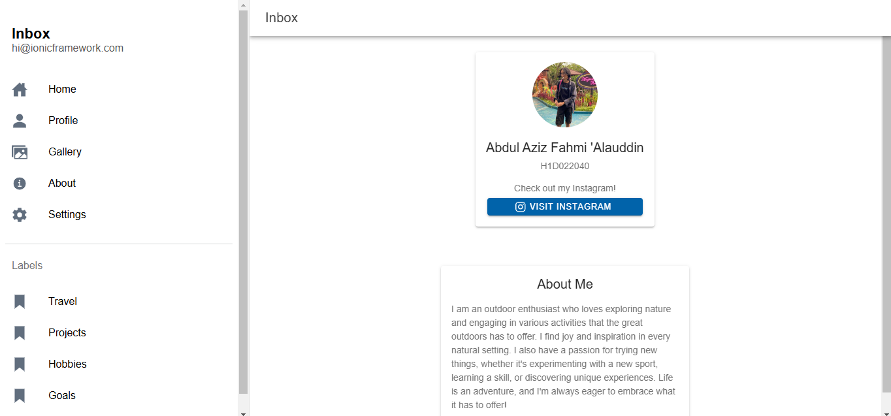

# LabMobile7_AbdulAziz_ShiftE
 
# Menambahkan Komponen di Halaman Ionic
Berikut adalah langkah-langkah untuk menambahkan komponen baru di halaman Ionic:

## 1. Mencari komponen yang dibutuhkan
Mencari komponen yang dibutuhkan seperti card, button, dan svg avatar pada [website dokumentasi komponen ionic](https://ionicframework.com/docs/components) 

## 2. Menerapkan Komponen pada Halaman
Setelah mendapat komponen, selanjutnya tingal menambahkan komponen tersebut ke halaman `folder.page.html`.
Berikut bagian komponen yang ditambahkan dan telah dimodifikasi:
```
<div id="info-card">
      <ion-card>
        
        <ion-card-header>
          <ion-card-title>Abdul Aziz Fahmi 'Alauddin</ion-card-title>
          <ion-card-subtitle>H1D022040</ion-card-subtitle>
        </ion-card-header>
        <ion-card-content>
          <p>Check out my Instagram!</p>
          <ion-button size="small" expand="block" color="secondary" href="https://instagram.com/sunbreathingg_" target="_blank">
            <ion-icon name="logo-instagram" slot="start"></ion-icon>
            Visit Instagram
          </ion-button>
        </ion-card-content>
      </ion-card>
    </div>
```
```
<div id="extras">
      <ion-card>
        <ion-card-header>
          <ion-card-title>About Me</ion-card-title>
        </ion-card-header>
        <ion-card-content>
          I am an outdoor enthusiast who loves exploring nature and engaging in various activities that the great outdoors has to offer. I find joy and inspiration in every natural setting. I also have a passion for trying new things, whether it's experimenting with a new sport, learning a skill, or discovering unique experiences. Life is an adventure, and I'm always eager to embrace what it has to offer!
        </ion-card-content>
      </ion-card>
    </div>
```


## 3. Kustomisasi Tampilan
Kemudian mengkustomisasi tampilan agar sedikit lebih baik pada halaman `folder.page.scss`

# Screenshots

|  |
|-------------------|
